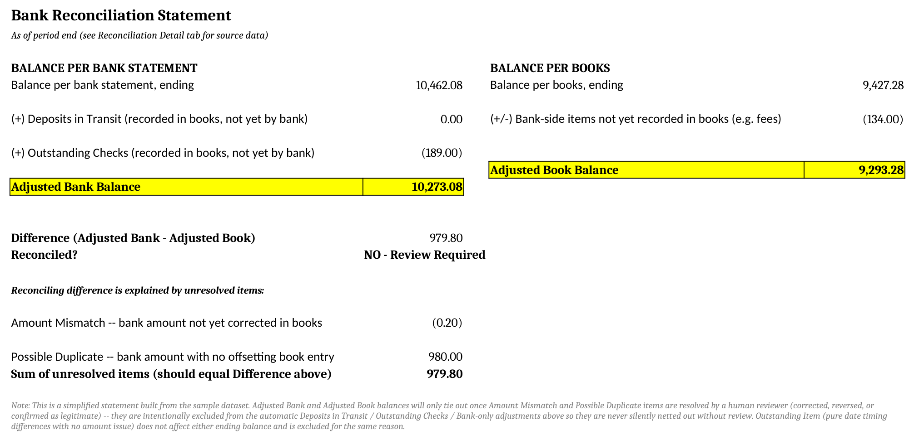
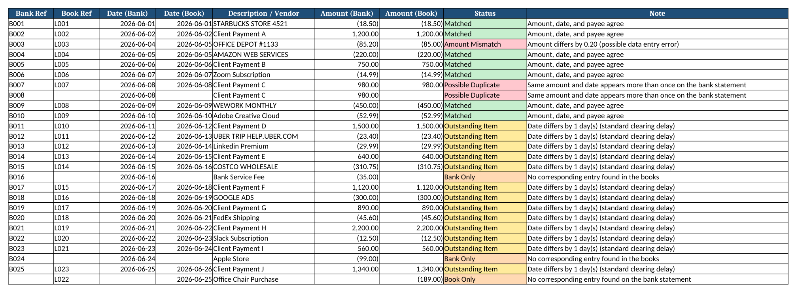
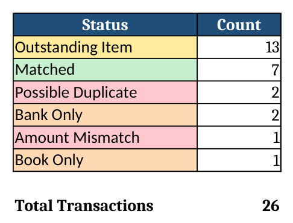

# AI-Assisted Bank Reconciliation Automation

A self-study project simulating a real bank reconciliation workflow: matching
bank transactions against company books, classifying discrepancies using
standard accounting categories, and using AI to draft (not finalize) a
summary report.

## Results at a glance

**Reconciliation Statement** -- Adjusted Bank Balance vs. Adjusted Book
Balance, built entirely from live Excel formulas:



**Reconciliation Detail** -- every transaction classified and color-coded
by status:



**Summary** -- transaction counts by status:



## Goal

Compare bank transactions (`bank_transactions.csv`) against the company's
general ledger (`book_transactions.csv`) and identify:

- Transactions that match cleanly
- Outstanding items (timing differences -- recorded by one side, not yet
  cleared by the other)
- Amount mismatches (e.g. data entry errors)
- Possible duplicate payments
- Bank-only items (e.g. unrecorded fees)
- Book-only items (e.g. checks not yet cleared)

...and produce a standard two-sided Bank Reconciliation Statement showing
the Adjusted Bank Balance and Adjusted Book Balance.

## Tools

- Excel (manual first pass: XLOOKUP, SUMIFS, PivotTable, Conditional Formatting)
- Python (pandas, rapidfuzz, openpyxl)
- ChatGPT / Claude (drafting the narrative summary, with mandatory human review)

## How it works

### 1. Matching logic

A naive `merge()` on Amount alone breaks once two transactions share the
same amount (it produces a cartesian product and matches the wrong rows).
Instead, every bank transaction is scored against each unclaimed book
transaction on three weighted factors, and the highest-scoring candidate
becomes the match:

| Factor | Weight | Method |
|---|---|---|
| Payee/description similarity | 40% | `rapidfuzz.fuzz.token_sort_ratio` (handles "STARBUCKS STORE 4521" vs. "Starbucks") |
| Date proximity | 30% | Closer dates score higher |
| Amount similarity | 30% | Closer amounts score higher |

### 2. Status classification

| Status | Condition |
|---|---|
| Matched | Payee, date, and amount all agree |
| Amount Mismatch | Payee/date agree, amount differs |
| Outstanding Item | Payee/amount agree, date differs by 1-3 days (standard clearing delay) |
| Possible Duplicate | Same amount + date appears more than once on the bank side |
| Bank Only | No corresponding entry in the books |
| Book Only | No corresponding entry on the bank statement |

### 3. Reconciliation Statement (Excel formulas, not hardcoded numbers)

The `Reconciliation Statement` tab in `reconciliation_output.xlsx` follows
the standard format:

```
Balance per Bank Statement
  + Deposits in Transit
  + Outstanding Checks
= Adjusted Bank Balance

Balance per Books
  +/- Bank-side items not yet recorded in books
= Adjusted Book Balance
```

Every cell is a live `SUM`/`SUMIFS` formula referencing the Detail tab, so
changing the source data automatically updates the statement. In this
sample dataset, the two balances do **not** tie out by exactly $979.80 --
and the sheet shows why: $980.00 of that gap is the unresolved Possible
Duplicate transaction (no offsetting book entry exists yet), and $0.20 is
the unresolved Amount Mismatch. Both are intentionally excluded from the
automatic adjustment formulas, because a duplicate-payment question and a
data-entry error are exactly the kind of items a human needs to resolve
before a period can be closed -- a reconciliation tool that silently nets
these out would be hiding the issue, not solving it.

### 4. AI-drafted summary (with verification)

`generate_ai_summary_prompt.py` builds a prompt for ChatGPT/Claude from the
reconciliation results and includes an explicit instruction that every
number in the response must match the source data exactly. See "AI Usage &
Verification" below for what actually happened when this was tested.

## AI Usage & Verification

This project was built with AI assistance (Claude), and this section
documents that honestly rather than hiding it -- including the mistakes
that came up and how they were caught.

**What AI generated:** the initial matching algorithm structure, the
classification logic, the Excel formula layout, and a first draft of this
README.

**What was caught during review, and how:**

1. **Matching logic bug.** The first version of `find_best_match()` in
   `reconcile.py` was supposed to return the metrics (name/date/amount
   difference) belonging to the *highest-scoring* candidate. Instead, due
   to a variable-scoping mistake, it returned the metrics from whichever
   candidate happened to be evaluated *last* in the loop -- which is
   unrelated to the best match. On a 25-row test set, this silently
   produced 20 false "Amount Mismatch" rows where almost everything should
   have been "Matched." This was caught not by reading the code, but by
   noticing the output didn't make sense (20 mismatches out of 25
   near-identical transactions is implausible) and tracing it back to the
   loop. Fix: store `best_name_score` / `best_date_diff` /
   `best_amount_diff` every time `best_score` is updated, not after the
   loop ends.

2. **Reconciliation Statement formula bug.** The first version of the
   Adjusted Bank / Adjusted Book formulas placed Deposits in Transit and
   Outstanding Checks on the wrong side of the equation (subtracting items
   from the Book balance that should have adjusted the Bank balance
   instead). The two balances came out off by $979.80. This was caught by
   manually recalculating both balances by hand from the raw CSV totals
   and comparing them to the formula output -- they didn't match, which
   forced a re-derivation of the standard "balance per bank / balance per
   books" format from first principles rather than trusting the first
   formula layout. The corrected, formula-driven statement is the
   screenshot at the top of this README -- note it still doesn't tie out
   to zero, and the sheet explains why (see point 3 below and the
   "Reconciling difference" rows in the screenshot).

3. **AI-drafted summary numeric error.** A draft narrative summary
   (`output/ai_draft_summary_raw.txt`) was generated from the
   reconciliation results. It stated the Office Depot amount discrepancy
   as "$0.30." The actual figure, recomputed directly from the Detail
   sheet ($85.20 - $85.00), is $0.20. The automated check
   (`verify_ai_summary()`) only confirms that the *transaction counts* in
   the Summary sheet appear in the text -- it does **not** check dollar
   figures embedded in the narrative, so it passed even with this error
   present. The mistake was only caught by reading the draft line by line
   against the Detail tab. The corrected version is
   `output/reconciliation_summary_FINAL.txt`, with a visible correction
   log at the bottom.

**Takeaway:** an automated numeric check is a useful first filter, but it
is not a substitute for reading the AI's output against the source data.
None of these three errors would have been caught by the automated
check alone -- two were structural bugs in the Python logic, and the
third was a narrative detail the count-matching check wasn't designed to
catch in the first place.

## How to run

```bash
pip install -r requirements.txt

# 1. Run matching + classification (prints summary to console)
python notebook/reconcile.py

# 2. Build the formatted Excel deliverable (Detail / Summary / Statement tabs)
python notebook/build_excel.py

# 3. Generate the AI prompt for the narrative summary
python notebook/generate_ai_summary_prompt.py
```

Example console output from step 1 (`python notebook/reconcile.py`):

```
=== Reconciliation Summary ===
            Status  Count
  Outstanding Item     13
           Matched      7
Possible Duplicate      2
         Bank Only      2
   Amount Mismatch      1
         Book Only      1

=== Reconciliation Statement Inputs ===
book_ending_balance: 9427.28
bank_ending_balance: 10462.08
deposits_in_transit: 0.00
outstanding_checks: -189.00
unrecorded_bank_items: -134.00
```

Outputs:
- `output/reconciliation_output.xlsx` -- Reconciliation Statement / Detail / Summary tabs
- `output/ai_prompt.txt` -- prompt to paste into ChatGPT/Claude
- `output/ai_draft_summary_raw.txt` -- example AI-generated draft (with the uncorrected error, kept for reference)
- `output/reconciliation_summary_FINAL.txt` -- human-reviewed final version

## Folder Structure

```
AI-Bank-Reconciliation/
│
├── data/
│   ├── bank_transactions.csv
│   └── book_transactions.csv
│
├── images/
│   ├── reconciliation_statement.png
│   ├── reconciliation_detail.png
│   └── summary.png
│
├── output/
│   ├── reconciliation_output.xlsx
│   ├── ai_prompt.txt
│   ├── ai_draft_summary_raw.txt
│   └── reconciliation_summary_FINAL.txt
│
├── notebook/
│   ├── reconcile.py
│   ├── build_excel.py
│   └── generate_ai_summary_prompt.py
│
├── requirements.txt
└── README.md
```

## Key Skills Demonstrated

Bank reconciliation methodology, fuzzy transaction matching, Excel formula
design (SUMIFS-based reconciliation statements), Python automation,
AI-assisted drafting with mandatory human verification.

## Limitations

- Built on a synthetic 25-row dataset; real bank/ledger data has more edge
  cases (partial payments, foreign currency, batched deposits, etc.).
- Matching thresholds (`NAME_SIMILARITY_THRESHOLD`, `TIMING_DIFF_MAX_DAYS`,
  `AMOUNT_MISMATCH_MAX_DIFF` in `reconcile.py`) were set heuristically for
  this dataset, not derived from a specific company's materiality policy.
- The matching algorithm is O(n x m) (nested loop scoring); this is fine
  at hundreds of rows but would need a smarter blocking/indexing strategy
  before scaling to a real company's monthly transaction volume.
- AI-generated narrative text is a draft only. As shown above, it can
  contain numeric errors that a count-based automated check will not
  catch -- a full human read-through against the source data is required
  before any AI-drafted summary is used as a final deliverable.
